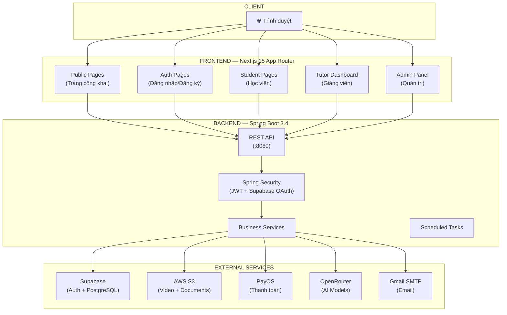
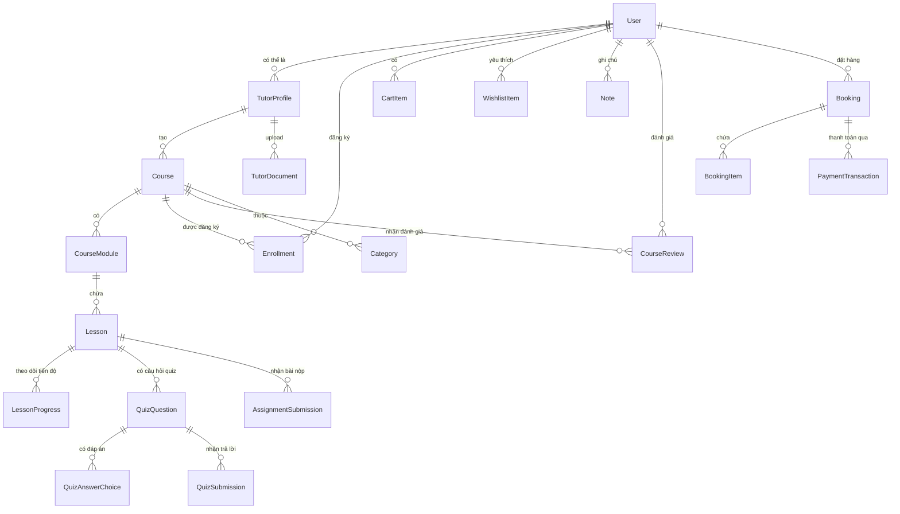

# EduStream — Sơ đồ Kiến trúc & Luồng Toàn Hệ Thống

## 1. Kiến trúc Tổng quan



---

## 2. Cấu trúc Frontend — Các Route chính

```
src/app/[locale]/
├── (public)/                        # Không cần đăng nhập
│   ├── page.tsx                     # 🏠 Trang chủ (Homepage)
│   ├── courses/                     # 📚 Danh sách khóa học
│   │   └── [courseId]/              # Chi tiết khóa học
│   ├── tutors/                      # 👨‍🏫 Danh sách giảng viên
│   │   └── [tutorId]/               # Trang cá nhân giảng viên
│   ├── learning/[courseId]/         # 🎓 Trang học tập (cần đăng nhập)
│   ├── my-learning/                 # 📖 Khóa học của tôi
│   ├── cart/                        # 🛒 Giỏ hàng
│   ├── payment/                     # 💳 Thanh toán
│   └── teaching/                    # 📢 Landing trang dành cho giảng viên
│
├── (auth)/                          # Nhóm xác thực
│   ├── login/                       # Đăng nhập
│   └── register/                    # Đăng ký
│
├── checkout/[id]/                   # Thanh toán khóa học
├── profile/                         # Hồ sơ cá nhân
│
├── tutor/                           # Khu vực Giảng viên
│   ├── onboarding/                  # Đăng ký trở thành giảng viên
│   ├── application/                 # Theo dõi trạng thái đăng ký
│   └── dashboard/                   # Dashboard giảng viên
│       ├── overview/                # Tổng quan
│       ├── manage/[courseId]/       # Quản lý khóa học
│       │   ├── basics/              #   - Thông tin cơ bản
│       │   ├── curriculum/          #   - Chương trình học
│       │   ├── assignments/[lessonId]/ # - Chấm bài
│       │   └── pricing/             #   - Giá
│       └── communication/           # Trung tâm giao tiếp
│           ├── qa/                  #   - Hỏi & Đáp
│           ├── messages/            #   - Tin nhắn
│           ├── assignments/         #   - Quản lý bài tập
│           │   └── [courseId]/submissions/[lessonId]/ # - Chấm bài (mới)
│           └── announcements/       #   - Thông báo
│
└── admin/                           # Khu vực Admin
    ├── users/                       # Quản lý người dùng
    ├── courses/                     # Duyệt khóa học
    └── tutors/                      # Duyệt hồ sơ giảng viên
```

---

## 3. Cấu trúc Backend — Các Controller & API

```
Controller                  Endpoint              Chức năng
────────────────────────────────────────────────────────────────────────
AuthenticationController    /api/auth/*           Đăng ký, Đăng nhập, Refresh Token,
                                                  Đổi mật khẩu, OAuth Supabase

UserController              /api/users/*          CRUD User, Upload Avatar

TutorProfileController      /api/tutors/*         Đăng ký Tutor, Upload chứng chỉ,
                                                  Cập nhật profile

TutorCourseController       /api/courses/*        Tạo/Sửa/Xóa khóa học, Module,
                                                  Lesson, Xuất bản

PublicCourseController      /api/public/courses/* Danh sách & Chi tiết khóa học công khai

CategoryController          /api/categories/*     Quản lý danh mục khóa học

AssignmentController        /api/assignments/*    Nộp bài, Lấy bài, Chấm điểm

QuizController              /api/quizzes/*        Tạo câu hỏi, Làm bài, Xem kết quả

ProgressController          /api/progress/*       Đánh dấu hoàn thành bài học,
                                                  Xem tiến độ khóa học

ReviewController            /api/reviews/*        Đánh giá & Nhận xét khóa học

StudentBookingController    /api/bookings/*       Tạo đơn đặt hàng

StudentPaymentController    /api/payments/*       Tạo link thanh toán PayOS

WebhookController           /api/webhooks/*       Nhận callback từ PayOS,
                                                  Kích hoạt Enrollment

StudentEnrollmentController /api/enrollments/*    Kiểm tra đăng ký khóa học

CartController              /api/cart/*           Giỏ hàng

WishlistController          /api/wishlist/*       Danh sách yêu thích

UserNoteController          /api/notes/*          Ghi chú trong khi học

FileController              /api/files/*          Upload file lên AWS S3

AICoachController           /api/ai/coach/chat    EduStream Coach Chatbot

PublicTutorController       /api/public/tutors/*  Danh sách giảng viên công khai

admin/*                     /api/admin/*          Duyệt giảng viên, Quản lý hệ thống
```

---

## 4. Sơ đồ Database (Entity Relationship)



---

## 5. Luồng nghiệp vụ chính

### 5.1 Luồng Đăng ký & Đăng nhập

```
[Email/Password]
Người dùng → POST /api/auth/register
    ↓ Tạo User trong DB
    ↓ Gửi email xác thực (Gmail SMTP)
    ↓
POST /api/auth/login
    ↓ Verify password (BCrypt)
    ↓ Tạo JWT Token (Access + Refresh)
    ↓ Trả về Token → Lưu vào Cookie

[OAuth Supabase - Google/GitHub]
Người dùng → Chọn "Đăng nhập với Google"
    ↓ Redirect đến Supabase OAuth
    ↓ Supabase xác thực với Google
    ↓ Callback về /authenticate
    ↓ Backend nhận Supabase Token → Tạo User nếu mới
    ↓ Tạo JWT của hệ thống → Đăng nhập thành công
```

---

### 5.2 Luồng Trở thành Giảng viên (Tutor Onboarding)

```
Người dùng → /tutor/onboarding
    ↓ Điền thông tin: Tên, Bio, Kinh nghiệm
    ↓ Upload chứng chỉ (PDF/Image → AWS S3)
    ↓ POST /api/tutors/apply
    ↓ Status: PENDING

Admin → Xem danh sách PENDING
    ↓ POST /api/admin/tutors/{id}/approve hoặc reject
    ↓ Status: APPROVED → User có role TUTOR
    ↓ Gửi email thông báo
```

---

### 5.3 Luồng Tạo & Xuất bản Khóa học

```
Giảng viên → Dashboard → Tạo khóa học mới
    ↓ POST /api/courses (status: DRAFT)
    ↓
Chỉnh sửa Basics (Tên, Mô tả, Thumbnail, Giá, Danh mục)
    ↓ PATCH /api/courses/{id}
    ↓
Xây dựng Curriculum (Module > Lesson)
    ↓ POST /api/courses/{id}/modules
    ↓ POST /api/modules/{id}/lessons
    ↓ Lesson types: VIDEO | TEXT | QUIZ | ASSIGNMENT
    ↓
Upload Video → AWS S3 (Presigned URL)
    ↓ GET /api/files/presigned-url
    ↓ Upload trực tiếp lên S3 từ browser
    ↓
Xuất bản → POST /api/courses/{id}/publish
    ↓ Admin duyệt → Status: PUBLISHED
    ↓ Khóa học xuất hiện trên trang công khai
```

---

### 5.4 Luồng Mua khóa học & Thanh toán

```
Học viên → Xem khóa học → "Thêm vào giỏ"
    ↓ POST /api/cart/add
    ↓
Xem giỏ hàng → "Thanh toán"
    ↓ POST /api/bookings (tạo Booking + BookingItems)
    ↓
POST /api/payments/create-link
    ↓ Gọi PayOS API → Tạo link thanh toán
    ↓ Redirect đến trang PayOS
    ↓
[Thành công] PayOS → Webhook POST /api/webhooks/payment
    ↓ Verify checksum
    ↓ Cập nhật PaymentTransaction → SUCCESS
    ↓ Tạo Enrollment cho từng khóa học
    ↓ Redirect: /payment/success

[Hủy] → DELETE /api/bookings/{id}
    ↓ Redirect: /payment/cancel
```

---

### 5.5 Luồng Học tập

```
Học viên → /learning/{courseId}
    ↓ Kiểm tra Enrollment
    ↓ Load toàn bộ Course (Modules + Lessons)
    ↓ Auto-select bài học đầu tiên
    ↓
Xem Video / Đọc bài
    ↓ Nhấn "Mark as Complete"
    ↓ POST /api/progress/complete/{lessonId}
    ↓ Cập nhật LessonProgress
    ↓
Làm Quiz
    ↓ GET /api/quizzes/{lessonId}/questions
    ↓ POST /api/quizzes/{lessonId}/submit
    ↓ Nhận kết quả ngay lập tức
    ↓
Nộp Assignment
    ↓ POST /api/assignments/{lessonId}/submit
    ↓ Upload file → AWS S3
    ↓ Chờ giảng viên chấm điểm
    ↓
Ghi chú
    ↓ POST /api/notes (timestamp video hiện tại)
    ↓
Hỏi EduStream Coach (AI)
    ↓ POST /api/ai/coach/chat
    ↓ [Xem luồng AI bên dưới]
```

---

### 5.6 Luồng Chấm bài (Tutor)

```
Giảng viên → Communication → Assignments
    ↓ Chọn Khóa học
    ↓ GET /api/courses/{courseId}/modules (lọc bài ASSIGNMENT)
    ↓ Chọn Bài tập
    ↓ GET /api/assignments/{lessonId}/submissions
    ↓
Xem bài nộp của từng học viên
    ↓ POST /api/assignments/submissions/{id}/grade
    ↓ { grade: 85, feedback: "..." }
    ↓ Status → GRADED
```

---

### 5.7 Luồng AI Coach (EduStream Coach)

```
Học viên gõ câu hỏi trong giao diện Chat
    ↓ [Frontend: AICoachChat.tsx]
    ↓ Optimistic UI: Hiện tin nhắn ngay
    ↓
POST /api/ai/coach/chat
    { courseId: "xxx", message: "..." }
    ↓ [AICoachController]
    ↓ [AICoachService]
    ↓
Thu thập nội dung khóa học từ DB
    → Course title + Description
    → Module titles
    → Lesson TEXT & ASSIGNMENT content (tối đa 3000 ký tự)
    → Strip HTML tags
    ↓
Xây dựng System Prompt (Guardrails)
    "Chỉ trả lời dựa trên nội dung khóa học"
    "Từ chối câu hỏi ngoài lề"
    ↓
Gọi OpenRouter với cơ chế Fallback
    → Model 1: openai/gpt-oss-20b:free
    → Model 2: qwen/qwen3-next-80b:free
    → Model 3: google/gemma-4-31b-it:free
    → Model 4: nvidia/nemotron-nano-12b:free
    ↓
Trả về câu trả lời → Hiển thị trong Chat UI
```

---

## 6. Bảo mật hệ thống

```
┌─────────────────────────────────────────────────┐
│              Spring Security Filter Chain         │
│                                                   │
│  Request → [JWT Filter] → [Role Check] → API     │
│                                                   │
│  PUBLIC (không cần token):                        │
│    /api/public/**                                 │
│    /api/auth/login, /register                     │
│    /api/webhooks/**                               │
│                                                   │
│  AUTHENTICATED (cần JWT):                         │
│    /api/users/**, /api/cart/**                    │
│    /api/progress/**, /api/notes/**                │
│    /api/ai/coach/**                               │
│                                                   │
│  TUTOR ONLY:                                      │
│    /api/courses/**, /api/assignments/grade/**     │
│                                                   │
│  ADMIN ONLY:                                      │
│    /api/admin/**                                  │
└─────────────────────────────────────────────────┘
```

---

## 7. Hạ tầng triển khai (Infrastructure)

```
┌──────────────┐    ┌──────────────────────────────┐
│   Vercel     │    │           VPS                 │
│  (Frontend)  │    │   Docker Container            │
│              │    │   ┌──────────────────────┐    │
│  Next.js 15  │───▶│   │  Spring Boot :8080   │    │
│  edu-stream  │    │   │  JDK 21              │    │
│  .dev        │    │   └──────────┬───────────┘    │
└──────────────┘    │              │                 │
                    │   ┌──────────▼───────────┐    │
                    │   │  .env.production      │    │
                    │   │  Secrets & Config     │    │
                    │   └──────────────────────┘    │
                    └──────────────────────────────┘
                                  │
            ┌─────────────────────┼──────────────────┐
            ▼                     ▼                   ▼
     ┌────────────┐      ┌──────────────┐    ┌──────────────┐
     │ Supabase   │      │   AWS S3     │    │   PayOS      │
     │ PostgreSQL │      │   Storage    │    │   Payment    │
     └────────────┘      └──────────────┘    └──────────────┘
